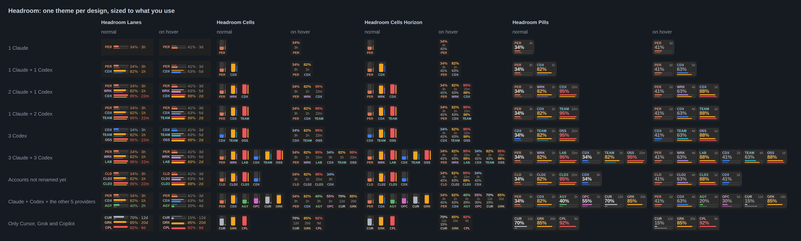
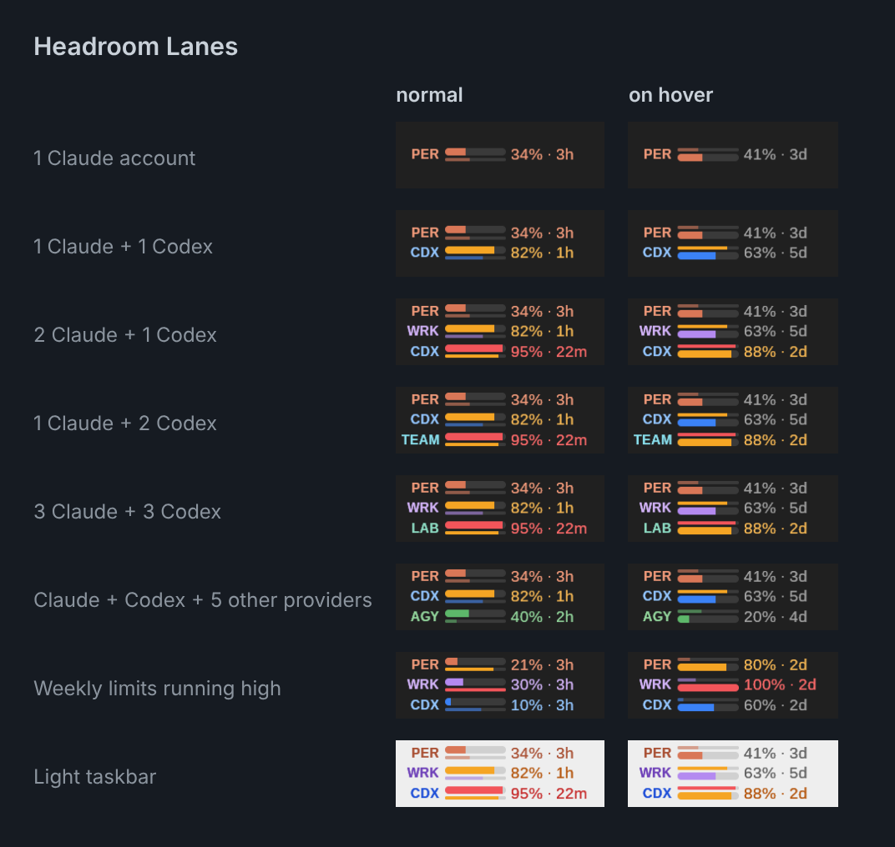
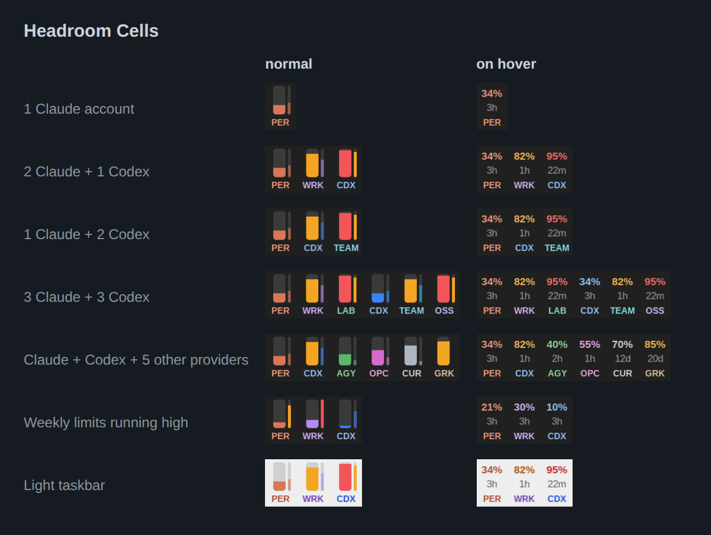
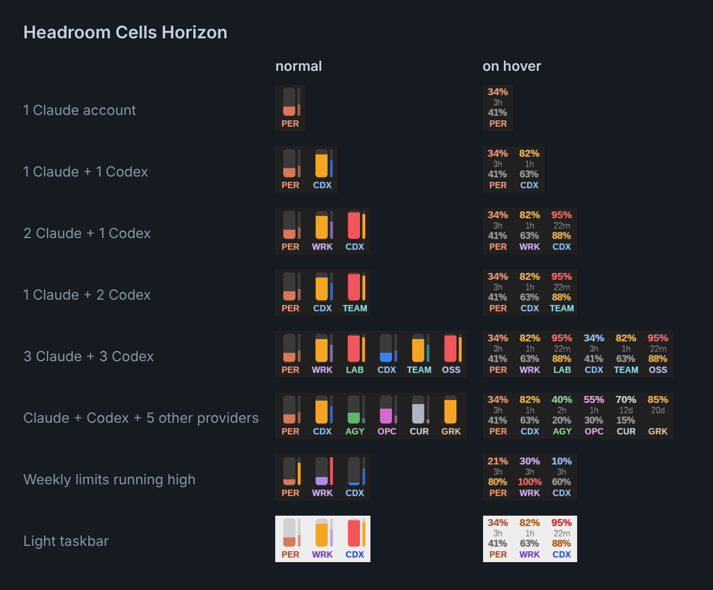
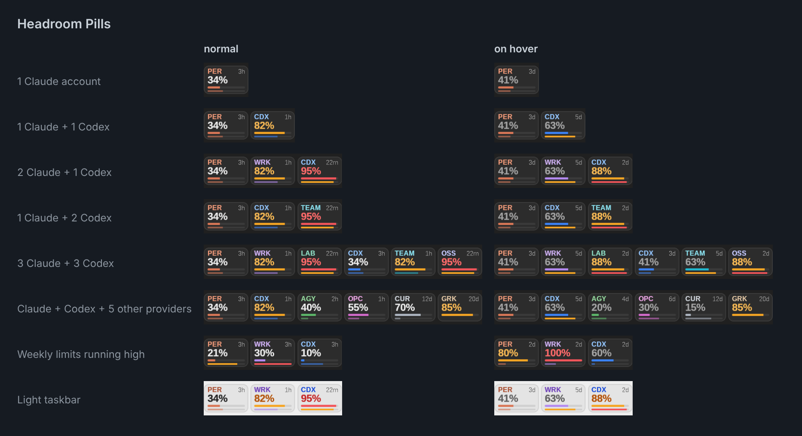
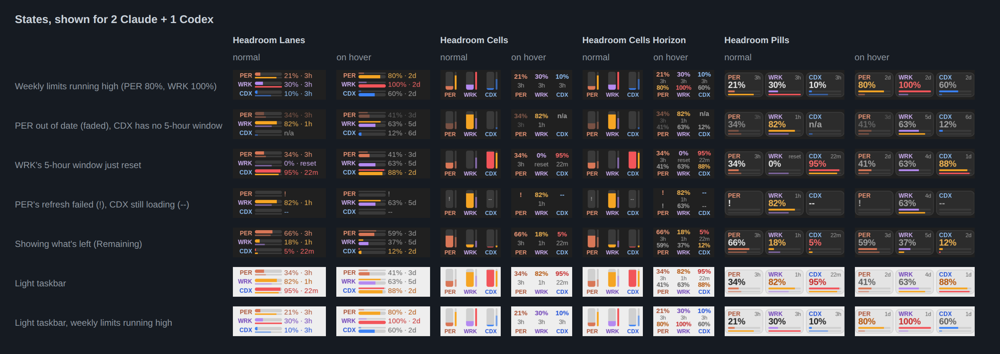
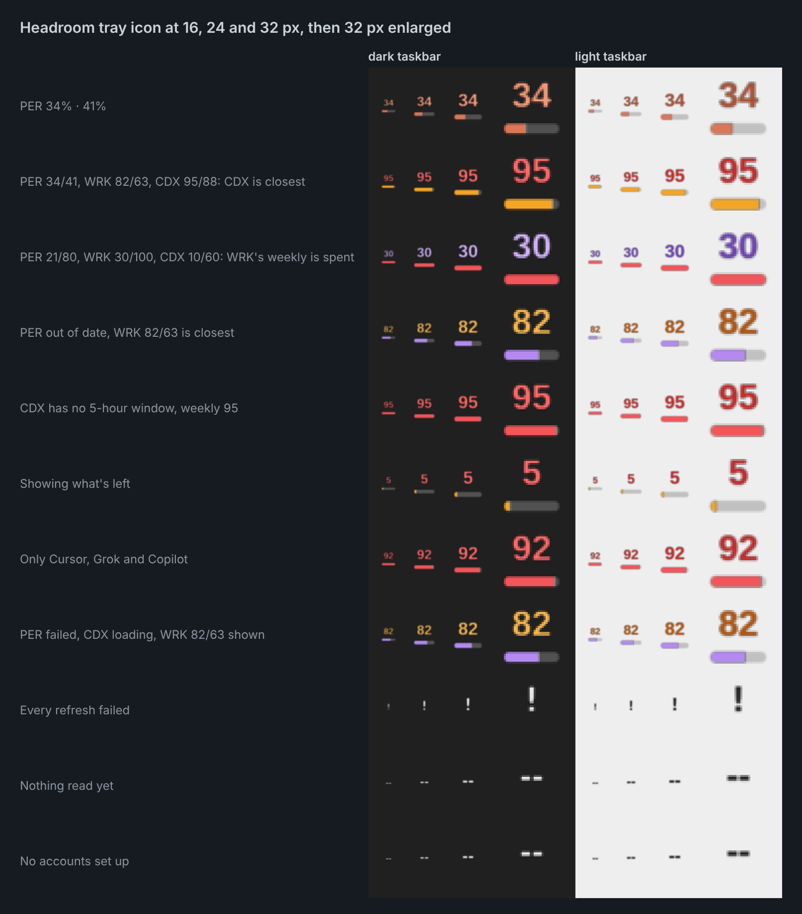

# Headroom: usage themes for Claude Code Usage Monitor

Headroom is a set of compact taskbar themes for [Claude Code Usage Monitor](https://github.com/CodeZeno/Claude-Code-Usage-Monitor),
the Windows taskbar widget by CodeZeno. They show how much headroom you have left on your AI usage
limits: up to 5 Claude accounts and 5 Codex accounts, plus Antigravity, OpenCode, Cursor, Grok and
Copilot (one account each) if you've turned them on in the monitor. Lanes shows up to 3 of these at
once and the other themes up to 6, and each theme widens or narrows to fit how many it's showing.



The previews are rendered by the monitor's own theme engine with sample data and a stand-in font; on
Windows the themes use Segoe UI.

## Contents

- [The themes](#the-themes)
  - [Headroom Lanes](#headroom-lanes)
  - [Headroom Cells](#headroom-cells)
  - [Headroom Cells Horizon](#headroom-cells-horizon)
  - [Headroom Pills](#headroom-pills)
- [Install](#install)
- [What shows](#what-shows)
  - [Account names](#account-names)
  - [Other providers](#other-providers)
- [Reading the widget](#reading-the-widget)
- [The tray icon](#the-tray-icon)
- [Clicks](#clicks)
- [Make your own](#make-your-own)
- [Troubleshooting](#troubleshooting)
  - [An account doesn't show](#an-account-doesnt-show)
- [Credits and license](#credits-and-license)

## The themes

| Theme | Download | Width for 1, 2, 3 slots | Shows up to | Best for |
| --- | --- | --- | --- | --- |
| [Headroom Lanes](#headroom-lanes) | [headroom-lanes.json](https://github.com/Sekers/headroom-ai-usage-monitor-themes/releases/latest/download/headroom-lanes.json) | 145 px for any number | 3 slots | Reading exact numbers at a glance |
| [Headroom Cells](#headroom-cells) | [headroom-cells.json](https://github.com/Sekers/headroom-ai-usage-monitor-themes/releases/latest/download/headroom-cells.json) | 30, 62, 94 px | 6 slots | The smallest footprint |
| [Headroom Cells Horizon](#headroom-cells-horizon) | [headroom-cells-horizon.json](https://github.com/Sekers/headroom-ai-usage-monitor-themes/releases/latest/download/headroom-cells-horizon.json) | 30, 62, 94 px | 6 slots | Cells, with the weekly percentage too when you hover |
| [Headroom Pills](#headroom-pills) | [headroom-pills.json](https://github.com/Sekers/headroom-ai-usage-monitor-themes/releases/latest/download/headroom-pills.json) | 60, 123, 186 px | 6 slots | The largest, easiest-to-read numbers |

Every slot has a main limit and, for most providers, a second one. For Claude and Codex they're the
5-hour and weekly windows; the other providers' limits are listed under
[Other providers](#other-providers).

### Headroom Lanes



* **Each slot** is a row: the name, a bar for the main limit over a thin line for the second, and the
  percentage with the time to reset.
* **On hover** each row switches to the second limit: its bar, percentage and time to reset, dimmed
  unless it's running high.
* **Size:** 145 px wide whatever it shows, with up to 3 rows.
* **Download:** [headroom-lanes.json](https://github.com/Sekers/headroom-ai-usage-monitor-themes/releases/latest/download/headroom-lanes.json)

### Headroom Cells



* **Each slot** is a vertical gauge for the main limit with a thin sliver for the second, and the
  name underneath.
* **On hover** each cell shows the main limit's percentage and time to reset.
* **Size:** 30 px for one slot and 32 px more for each extra one, up to 6.
* **Download:** [headroom-cells.json](https://github.com/Sekers/headroom-ai-usage-monitor-themes/releases/latest/download/headroom-cells.json)

### Headroom Cells Horizon



* **Each slot** looks just like Cells.
* **On hover** each cell shows the main limit's percentage and time to reset, with the second limit's
  percentage under them, in gray unless it's running high. Its time to reset is the one number left
  out; Lanes and Pills show it.
* **Size:** the same as Cells.
* **Download:** [headroom-cells-horizon.json](https://github.com/Sekers/headroom-ai-usage-monitor-themes/releases/latest/download/headroom-cells-horizon.json)

### Headroom Pills



* **Each slot** is a card: the name and time to reset, a large percentage, a bar for the main limit
  and a thin line for the second.
* **On hover** each card switches to the second limit, dimmed unless it's running high.
* **Size:** 60 px per card with 3 px between them, up to 6.
* **Download:** [headroom-pills.json](https://github.com/Sekers/headroom-ai-usage-monitor-themes/releases/latest/download/headroom-pills.json)

## Install

1. Install Claude Code Usage Monitor (`winget install CodeZeno.ClaudeCodeUsageMonitor`), version
   2.18.1 or later. The themes were built and tested against 2.18.1.
2. Download a theme by clicking its file in the **Download** column of [The themes](#the-themes), or
   from the assets of the
   [latest release](https://github.com/Sekers/headroom-ai-usage-monitor-themes/releases/latest).
3. Open the monitor's dashboard, go to **Theme Studio**, click the upload icon (its tooltip says
   **Import...**) and choose the file.
4. Select it under **Settings > Appearance > Active theme** if it isn't already active.

## What shows

Each account or provider you use gets one slot, in this order:

| Provider | Slots | Why |
| --- | --- | --- |
| Claude | 1 per account, up to 5 | The monitor supports several Claude accounts; the themes look for the first 5. |
| Codex | 1 per account, up to 5 | The same as Claude. |
| Antigravity, OpenCode, Cursor, Grok, Copilot | 1 each | The monitor supports one account for each of these. |

* **How many show at once:** Lanes shows the first 3 slots and the other themes the first 6, counting
  in the order above. With only two providers turned on, say Cursor and Copilot, you get exactly two
  slots.
* **Order:** Claude accounts first, then Codex accounts, each in the order you added them, then the
  other providers.
* **Anything turned off** under **Settings > Providers** doesn't show and takes no space, once the
  monitor's next refresh finishes. The widget resizes itself when you add or remove an account or
  turn a provider on or off.
* **Claude is on by default** in the monitor. If you don't use it, turn it off; otherwise its unused
  account still gets a slot, showing `CLD` and `!`.
* **At startup** each Claude or Codex account appears once its first refresh finishes; until then the
  widget shows `--`.

### Account names

* **Short names work best.** Each Claude and Codex account is labeled with its name, so rename them
  to three or four characters, such as `PER`, `WRK` or `CDX`, under **Settings > Providers >
  Accounts**. Longer names are cut off.
* **Accounts you haven't renamed** keep the names the monitor gave them, "Default" and "Account 1",
  "Account 2" and so on. Those show as `CLD` or `CDX` for a provider's first account and with the
  account's number after that, such as `CLD2` or `CDX3`.
* **The Default account dropdown** doesn't change what these themes show; it only picks the account
  the tray icon's tooltip describes.
* **Account IDs.** The monitor gives each account a fixed ID: a provider's first account is `default`,
  accounts you add are `account_1`, `account_2` and so on, and an ID is never reused, even after you
  delete its account. The themes look for `default` through `account_4` for each provider, which is
  where the limit of 5 comes from. Each account's ID shows as its **Theme binding**, inside the
  account's **Custom credentials file** section under **Settings > Providers > Accounts**. If an
  account doesn't show, see [Troubleshooting](#an-account-doesnt-show).

To keep several Claude logins signed in at once, give each its own configuration directory (Claude
Code's `CLAUDE_CONFIG_DIR`) and point the account's **Config directory** at it.

### Other providers

Antigravity, OpenCode, Cursor, Grok and Copilot have a single account and no name, so each gets a
fixed label and color. Their limits aren't all 5-hour and weekly windows:

| Provider | Label | Main limit | Second limit |
| --- | --- | --- | --- |
| Antigravity | `AGY` | session quota | weekly quota, when reported |
| OpenCode | `OPC` | rolling window | longer window (weekly or 30 days) |
| Cursor | `CUR` | included plan usage | API usage (same billing cycle) |
| Grok | `GRK` | usage pool (weekly or 30 days) | none |
| Copilot | `CPL` | premium requests this month | none |

Grok and Copilot have no second limit, so hovering shows their one limit again. A provider that's
turned on but not installed or signed in shows `!`.

When a plan doesn't report its main limit, such as a Codex plan without a 5-hour window, its second
limit takes the main one's place, and the slot works like Grok's and Copilot's.

## Reading the widget

* **Colors.** Each slot keeps its own color wherever it sits. By account ID, Claude accounts are
  coral, lavender, mint, rose and olive; Codex accounts are blue, teal, indigo, steel and violet. The
  other providers are green (Antigravity), magenta (OpenCode), silver (Cursor), tan (Grok) and pink
  (Copilot).
* **Warnings.** Both limits warn the same way: a bar, line or figure turns amber at 75% used and red
  at 90%. The thin line stays quiet until then, so a weekly limit that's running out stands out even
  while you're watching the 5-hour bar.
* **After a reset.** Once a limit's reset time passes, it shows `0%` and `reset` right away instead of
  the old figure, until the monitor's next refresh brings the new reading.
* **Faded figures** are left over from an earlier refresh because the latest one failed, often an
  HTTP 429 from Anthropic's usage endpoint. If that happens a lot, raise **Update frequency** under
  **Settings > General** (the default is 15 minutes).
* **`!`** means the last refresh failed with nothing to fall back on; hover the tray icon for the
  reason. **`--`** means it's still loading. **`n/a`** means the plan doesn't report that limit.
* **Used or remaining.** **Settings > Display > Usage direction** switches between showing what
  you've used and what's left.
* Light and dark taskbars both have their own colors.

The same four themes in each state, shown for 2 Claude + 1 Codex:



## The tray icon

Every theme comes with the same tray icon, so you can keep an eye on your limits with the widget
hidden.

* **One account at a time.** The icon shows whichever account is closest to any of its limits: its
  main limit (the 5-hour window, for Claude and Codex) as a number in the account's color, over a
  bar for its second limit. A plan without a 5-hour window shows its weekly limit in both places.
  Both turn amber and red like the widget, so a weekly limit that's running out shows even when the
  number is low. Grok and Copilot, which have one limit, show it in both places.
* **Faded, `!` and `--`** mean the same as on the widget.
* **Hover** for the monitor's tooltip: each provider's usage for its default account, or why a refresh
  failed.
* **Pin it** to keep it on the taskbar: Windows puts new tray icons under the **^** arrow at first.



## Clicks

| | Widget | Tray icon |
| --- | --- | --- |
| Click | Nothing; drag to move it | Hide or show the widget |
| Double-click | Open the dashboard | Open the dashboard |
| Right-click | The monitor's menu | The monitor's menu |
| Hover | Switch to the second limit | The monitor's tooltip |

## Make your own

The themes come from [generator/build.py](generator/build.py). Edit `ACCOUNT_IDS`, the colors, the
other providers' limits or the warning thresholds near the top, or a theme's maximum number of slots in
`DESIGNS`, then run it with Python 3:

```
python generator/build.py
```

It writes the four themes to `themes/`. Each provider has 5 account colors, so IDs past the fifth
reuse them from the start. To check the themes with the monitor's own engine and redraw the previews,
see [generator/engine-test](generator/engine-test/README.md).

Run `python generator/build.py --check` to verify the generated files without rewriting them.
It fails if a theme is missing, differs from the generator, or an unexpected JSON file is present.
GitHub Actions checks this and renders the themes with the native Windows engine on pushes and
pull requests, and before publishing a release.

## Troubleshooting

### An account doesn't show

First make sure its **Monitor** box is ticked under **Settings > Providers > Accounts**. An account
you add starts with it unticked, and an unticked account never shows.

Then check its **Theme binding**, inside the account's **Custom credentials file** section. If it ends
in `account_5` or higher, the themes don't look for it. That happens after you've deleted and added
accounts a few times, because a deleted account's ID is never handed out again. You can fix it by
giving the account a free ID in the monitor's settings file:

1. Right-click the widget and choose **Exit**, so the monitor can't overwrite your change.
2. Press **Win+R**, paste `notepad %APPDATA%\ClaudeCodeUsageMonitor\settings.json` and press
   **Enter**.
3. Find `"accounts"`, then `"claude"` or `"codex"`, then the account in `"profiles"` by its `"name"`.
4. Change its `"id"` to one from `default`, `account_1`, `account_2`, `account_3` or `account_4` that
   no other account under the same provider has. If the provider's `"selected"` line has the old ID,
   change it there too.
5. Save the file and start the monitor again.

For example, with your second Claude account stuck on `account_6` and `account_1` free:

```text
"claude": {
  "profiles": [
    { "id": "default", "name": "PER", ... },
    { "id": "account_6", "name": "WRK", ... }
  ],
  "selected": "default",
  "used_ids": ["account_1", "account_2", "account_3", "account_4", "account_5", "account_6", "default"]
}
```

change `"id": "account_6"` to `"id": "account_1"` and leave the rest. `used_ids` is the list of IDs
the monitor won't hand out again; it can stay as it is.

**To stop it from happening,** delete the IDs you no longer use from `used_ids` (here, everything but
`account_1` and `default`) before you add your next account, the same way: exit, edit, save, start.
New accounts then get the lowest free ID again. Removing an ID that's still in use does no harm; the
monitor adds it back.

**If you'd rather not edit the settings,** you can change the theme instead. Open the theme's `.json`
file in a text editor, replace every `accounts.claude.account_4` (or `accounts.codex.account_4`)
with the stuck account's binding, such as `accounts.claude.account_6`, then import the theme again in
**Theme Studio**. If you do have an `account_4`, replace an ID you don't use instead. Give that account
a short name too: the theme no longer recognizes the name the monitor gave it, such as "Account 6",
so it shows that name, cut off, instead of a short label like `CLD5`. Or rebuild the themes with more
IDs in `ACCOUNT_IDS` (see [Make your own](#make-your-own)).

## Credits and license

MIT; see [LICENSE](LICENSE). The themes start from Claude Code Usage Monitor's built-in Compact Fluent
Quad theme (MIT, Code Zeno Pty Ltd); see [THIRD-PARTY-NOTICES.md](THIRD-PARTY-NOTICES.md).

This project isn't affiliated with or endorsed by CodeZeno or any of the AI providers it shows.
Product names are trademarks of their owners.
